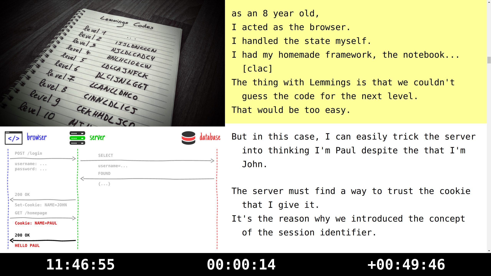

= ensuite-present

_ensuite-present_ is part of the *ensuite* toolkit dedicated to trainers and speakers.

== Overview

_ensuite-present_ is a local web app that allows an instructor to "open" and control a slide-deck.
It provides a dual screen setup using two browser windows, one for the presentation console that the instructor sees and one for the projector viewport that the class sees.

A screenshot of the presentation console is shown below.
The left-hand pane of the presentation console shows the current and next slide.
The right-hand pane shows the speaker notes, with the notes for the current slide highlighted.

The projector viewport window shows the current slide fit to the browser window.
It synchronizes when the instructor advances in the presentation console window.

=== Notes

The notes you see on the left are provided by the slide deck.
For now, it only works with a custom plugin on bespokejs presentations.
The notes are extracted from the HTML slides by the plugin and then transmitted from the deck to _ensuite-present_ through a protocol.

This protocol and plugin are still a Work In Progress so specification, documentation and details in general aren't available yet.

== Prerequisite

You need https://nodejs.org[Node] 7.4.0 (and npm){blank}footnoteref:[nvm,We strongly recommend using https://github.com/creationix/nvm[nvm] to manage Node.] in order to install and run _ensuite-present_.

 $ nvm install stable

== Installation

_ensuite-present_ is a CLI tool that you install globally with npm.

 $ npm install -g ensuite-present

== Usage

To run _ensuite-present_ on your machine, you just need to run this command:

 $ prz

You can now visit the presentation console and projector viewport at the following URLs:

 Projector viewport::
 \http://localhost:4320/pages/slide-deck-viewer/slide-deck-viewer-page.html

 Presentation console::
 \http://localhost:4320/pages/teleprompter-console/teleprompter-console-page.html?slide-deck-url=http://localhost:4321/my-awesome-slide-deck.html

NOTE: Customize the `slide-deck-url` parameter in the query string to view the slide deck you want.
